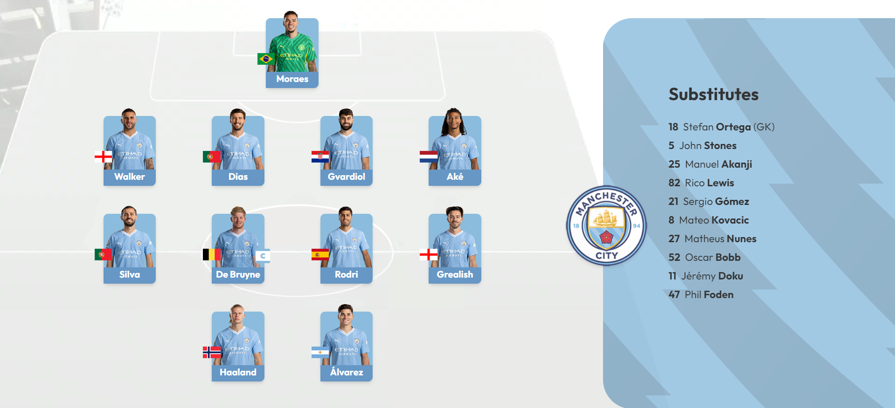

# Manchester City - Formation Builder

This is an application made with react, with the aim of testing the [@formkit/drag-and-drop](https://drag-and-drop.formkit.com/) library by creating an interface based on the ui of the official premier league broadcasts, it allows you to create a formation with the players of machester city.

### Screenshot

## Reference

### Links

- Live Site URL: [https://mci-formation-builder.netlify.app/](https://mci-formation-builder.netlify.app/)

## Note

This is for educational and entertainment purposes, all rights reserved belong to [PremierLeague](https://www.premierleague.com/).

## Author

- Website - [Samuel Figueroa](https://sfweb.netlify.app/)
